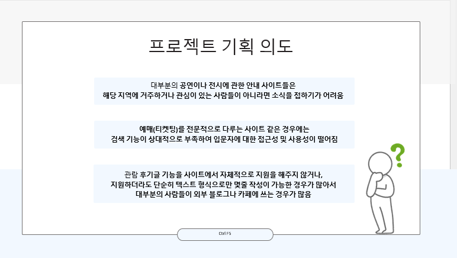
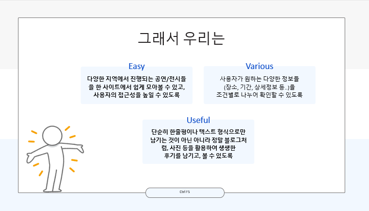
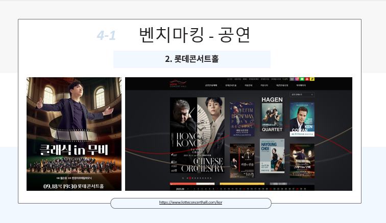
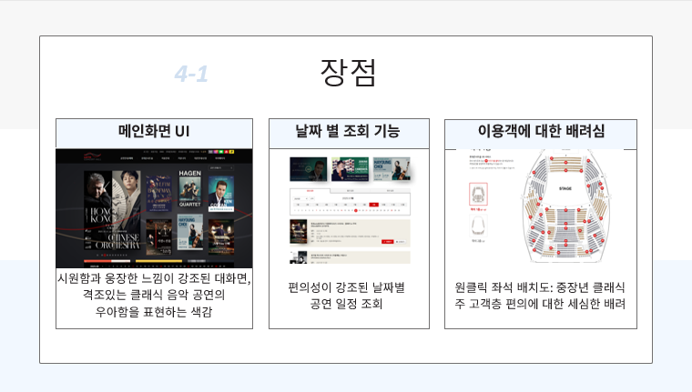
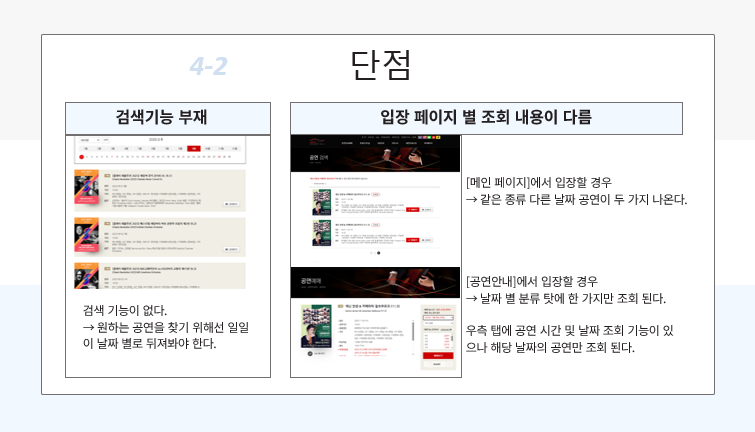
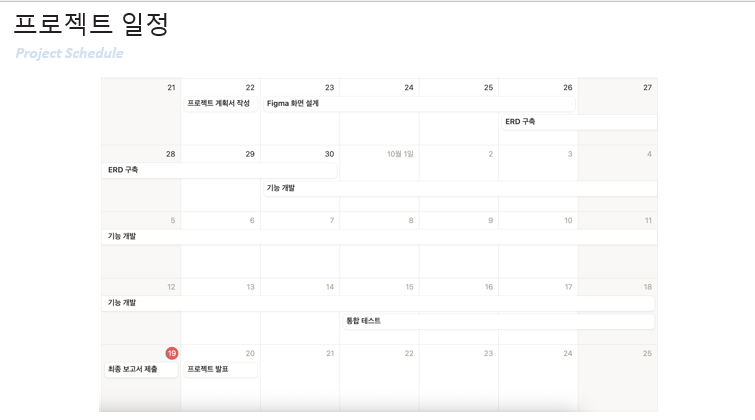
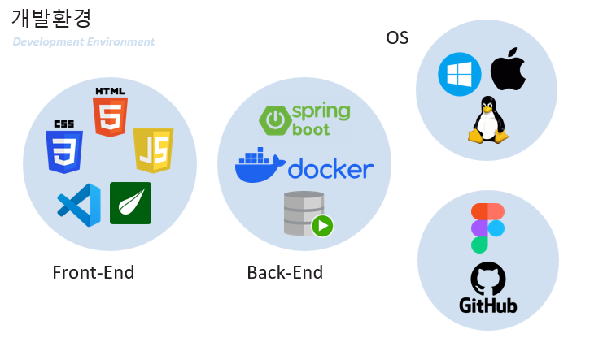
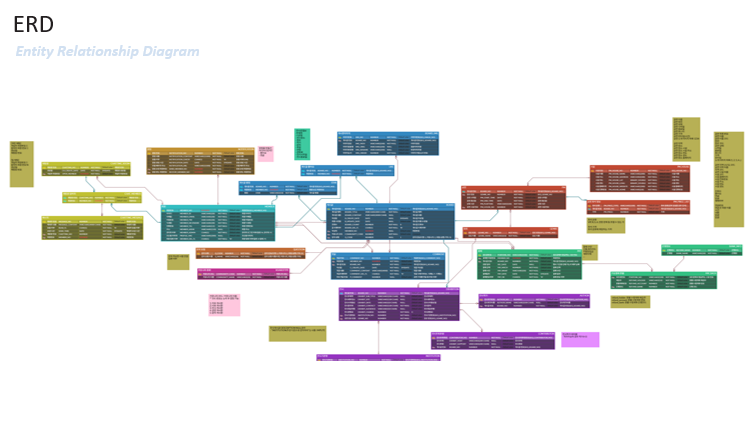
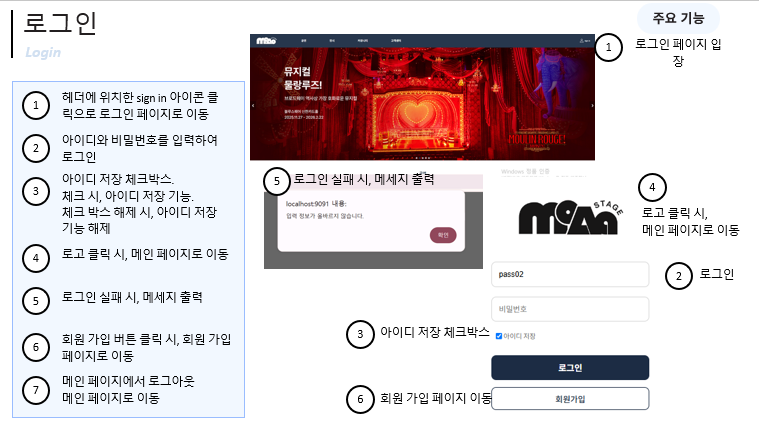
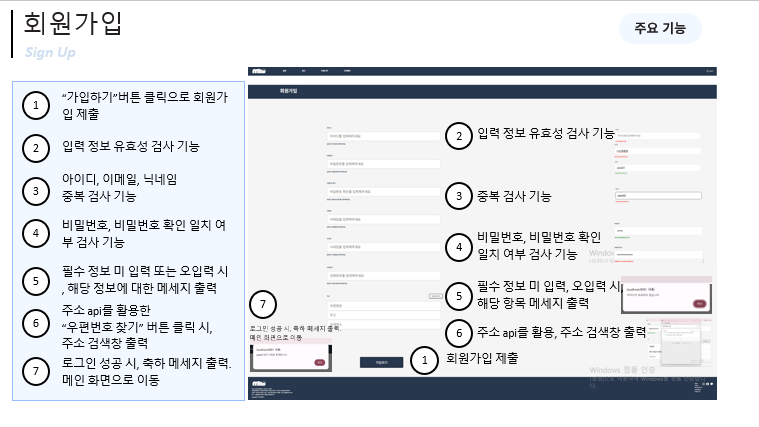

<!-- 상단 타이틀 배너 (네온 테마) -->

  

<!-- 프로필 사진 및 소개 영역 -->

  

 

  💡 <b>꾸준한 성장과 탄탄한 기본기를 추구하는 웹 개발자 지망생입니다.</b>

 

<!-- 🛠 기술 스택 섹션 (요청하신 11개 기술 전부 포함, 정돈된 스타일) -->
## 🛠 Tech Stacks

### 💻 Frontend
  

### ⚙️ Backend & Language
   

### 💾 Database & Search
 

### 🚀 DevOps & Tools
 

 

 

 

 

 

 

 

 

 

 

 

<!-- 📫 연락처 섹션 -->
## 📫 Contact & Link

*   **Email :** `field56@naver.com` <!-- 본인 이메일로 수정하세요 -->

